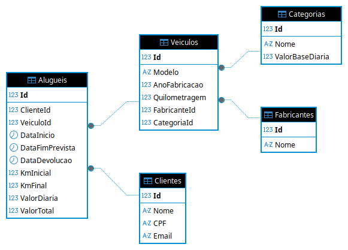

# Locadora de Veiculos - Documentacao da Demanda

Disciplina: **Tecnologias para Analise e Desenvolvimento de Sistemas**

## Objetivo

Documentar o progresso da atividade academica de desenvolvimento de um sistema de locadora de veiculos com ASP.NET Core e Entity Framework.

## Modelagem MER

Imagem do modelo entidade-relacionamento (MER) produzido para a atividade:

Arquivo: `arquivos/mer-locadora-veiculos.png`

---

## Status Geral da Atividade

- [x] Etapa 1: Modelagem do Banco de Dados
- [x] Etapa 2: Implementacao do Backend
  - [x] 2.1 - ASP.NET Core RESTful
  - [x] 2.2 - CRUD Completo (5 Controllers)
  - [x] 2.3 - Entity Framework + SQL Server
  - [x] 2.4 - Validacao de dados e tratamento de erros
  - [x] 2.5 - 5 Filtros com JOINs diferentes
  - [x] REFATORACAO: Generic Repository Pattern (eliminada duplicacao de codigo)
- [ ] Etapa 3: Testes e Documentacao
- [ ] Etapa 4: Video Apresentacao (Pitch)

---

## Etapa 1 - Modelagem do Banco de Dados (Concluida)

### 1.1 Modelo conceitual

Entidades modeladas:

- `Cliente`
- `Fabricante`
- `Veiculo`
- `Aluguel`
- `Categoria`

Regras atendidas:

- Todo `Veiculo` pertence a um `Fabricante` e possui `Modelo`, `AnoFabricacao` e `Quilometragem`.
- `Cliente` possui `Nome`, `CPF` e `Email`.
- Todo `Aluguel` referencia um `Cliente` e um `Veiculo` com periodo (`DataInicio`, `DataFimPrevista`, `DataDevolucao`).
- `Aluguel` registra `KmInicial`, `KmFinal`, `ValorDiaria` e `ValorTotal`.

### 1.2 Traducao para modelo relacional com Entity Framework

Implementado com EF Core no projeto `Locadora.Api`:

- `Locadora.Api/Infra/Data/LocadoraContext.cs`
- `Locadora.Api/Infra/Data/Migrations/20260410211422_InitialCreate.cs`

### 1.3 Chaves e restricoes de integridade

- PK em todas as tabelas (`Id`).
- FKs principais:
  - `Veiculo.FabricanteId -> Fabricante.Id`
  - `Veiculo.CategoriaId -> Categoria.Id`
  - `Aluguel.ClienteId -> Cliente.Id`
  - `Aluguel.VeiculoId -> Veiculo.Id`
- Restricao de unicidade:
  - `Cliente.CPF` com indice unico.

### 1.4 Classes de entidades em C#

Arquivos principais:

- `Locadora.Api/Domain/Entities/Cliente.cs`
- `Locadora.Api/Domain/Entities/Fabricante.cs`
- `Locadora.Api/Domain/Entities/Veiculo.cs`
- `Locadora.Api/Domain/Entities/Aluguel.cs`
- `Locadora.Api/Domain/Entities/Categoria.cs`

### 1.5 Minimo de 5 entidades

Requisito atendido com 5 entidades no dominio.

---

## Etapa 2 - Implementacao do Backend (Pendente)

### Itens solicitados

- APIs RESTful em ASP.NET Core.
- CRUD completo para entidades do sistema.
- Integracao com SQL Server via Entity Framework.
- Validacao de dados e tratamento de erros/excecoes.
- 5 filtros com uso de pelo menos 2 tipos de joins.

---

## Etapa 3 - Testes e Documentacao (Pendente)

### Itens solicitados

- Integracao e uso de Swagger.
- Documentacao detalhada de endpoints (metodos, parametros, respostas).
- Testes manuais via Swagger.
- Testes adicionais (automatizados, se necessario).
- Documentacao do funcionamento dos filtros.

---

## Etapa 4 - Video Apresentacao (Pendente)

### Itens solicitados

- Video pitch demonstrando o sistema.
- Apresentacao das funcionalidades principais.
- Demonstracao de uso das APIs.
- Publicacao em plataforma (ex.: YouTube).
- Insercao do link no relatorio academico.
- Duracao entre 6 e 12 minutos.

---

## Observacao Atual

No momento, o projeto esta documentado e implementado ate a **Etapa 2**.

